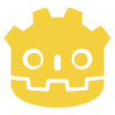

# `acore-godot`   [](https://www.gnu.org/licenses/gpl-3.0) [](https://ahmetcetinkaya.me/donate)

This repository provides a comprehensive core package written in C# for Godot
Engine, containing reusable implementations, abstractions, and helper code
snippets for Godot projects. It aims to offer optimized, modular, and
maintainable solutions for common needs in Godot development.

## Technologies Used

This project is built using the following technologies:

[](https://godotengine.org/)
[](https://docs.microsoft.com/en-us/dotnet/csharp/)

### Minimal Package Usage

This package minimizes the use of external dependencies. Most implementations
are written using Godot's C# API and .NET core libraries to ensure better
control, performance, and maintainability.

### Godot-Specific Implementations

`acore-godot` contains Godot-specific components, utilities, and abstractions,
providing reusable and optimized solutions tailored for Godot projects.

## What's Included?

- **Player System** (`src/ACore.Player/`): Comprehensive 3D player controller
  with modular features:
    - **Movement** (`Movement/`): First-person movement with WASD controls,
      sprinting, crouching, and lean mechanics
    - **Interaction** (`Interaction/`): Raycast-based interaction system with
      `IInteractable` abstraction
    - **Grabbing** (`Grabbing/`): Physics-based object grabbing and throwing
      mechanics
- **Math Extensions** (`src/ACore.Math/`): Utility methods for common math
  operations including Vector2 and Vector3 linear interpolation
- **Dev Assets** (`src/ACore.Dev/Textures/Grids`): Development textures and grid
  assets for prototyping and debugging
- **Environment Assets** (`src/ACore.Environment/Sky/hdris`): High-quality HDR
  skybox textures for environment lighting

## Getting Started

### Requirements

- Godot Engine 4.4.1 or later
- .NET SDK 8.0 or later (for C# support)

### Installation

Restore local tools:

```bash
dotnet tool restore
```

### Available Scripts

The project includes several convenient scripts defined in `global.json`:

| Script                  | Description                                        |
| ----------------------- | -------------------------------------------------- |
| `dotnet r build`        | Build the solution                                 |
| `dotnet r clean`        | Clean build artifacts                              |
| `dotnet r rebuild`      | Clean and rebuild                                  |
| `dotnet r test`         | Run tests                                          |
| `dotnet r format`       | Format all files (shell, markdown, yaml, json, C#) |
| `dotnet r godot`        | Open Godot                                         |
| `dotnet r godot:editor` | Open Godot editor                                  |
| `dotnet r godot:run`    | Run project in Godot                               |

### Installation as a Submodule

To add this repository as a submodule to your Godot project:

1. Navigate to your project directory:

    ```bash
    cd your-godot-project
    ```

2. Add the submodule:

    ```bash
    git submodule add https://github.com/ahmet-cetinkaya/acore-godot.git packages/acore-godot
    ```

3. Initialize and update the submodule:

    ```bash
    git submodule update --init --recursive
    ```

4. Enable the AutoLoad script or attach the Player scene to your project
   depending on your needs.

## Usage Example

### Player Controller

The Player scene (`src/ACore.Player/Player.tscn`) provides a complete first-person
controller. To use it:

1. Drag the `Player.tscn` scene into your main scene
2. Configure input actions in your project's Input Map:
    - `move_forward`, `move_backward`, `move_left`, `move_right`
    - `sprint`, `crouch`
    - `lean_left`, `lean_right`
    - `interact`, `grab`

### Interaction System

To make an object interactable, implement the `IInteractable` interface:

```csharp
using ACore.Player.Interaction.abstraction;

public partial class MyInteractable : Node3D, IInteractable
{
    public void Interact(Node3D interactor)
    {
        GD.Print("Interacted by: " + interactor.Name);
    }
}
```

### Math Extensions

```csharp
using ACore.Math;

Vector3 from = new Vector3(0, 0, 0);
Vector3 to = new Vector3(10, 10, 10);
Vector3 result = MathfExtensions.Lerp(from, to, 0.5f);
```

## Documentation

For detailed documentation and guides:

- **[Quick Start Guide](docs/guides/QUICKSTART.md)** - Get up and running quickly
- **[Customization Guide](docs/guides/CUSTOMIZATION.md)** - Extend and customize the player system
- **[Project Structure](docs/PROJECT_STRUCTURE.md)** - Understanding the codebase organization
- **[API Reference](docs/api/)** - Detailed API documentation

## Contributing

We welcome contributions! Please see the following guidelines:

1. Fork the repository
2. Create a new branch (`git checkout -b feat/feature-branch`)
3. Make your changes
4. Commit your changes (`git commit -m 'feat: add new feature'`)
5. Push to the branch (`git push origin feat/feature-branch`)
6. Open a Pull Request

## License

This project is licensed under the GNU General Public License v3.0 - see the
[LICENSE](./LICENSE) file for details.
